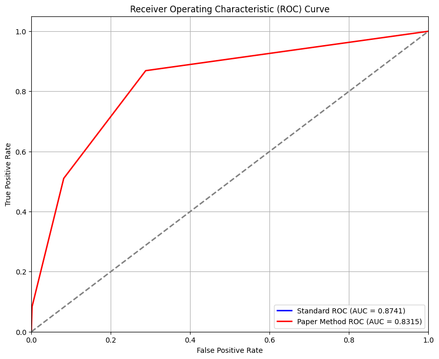

# Event Camera Background Activity Denoising (MLPF Filter Project)

## Project Overview and Goals

Event cameras (Dynamic Vision Sensors) output asynchronous event streams rather than traditional frames. A major challenge in using DVS data is **background activity (BA) noise**—spurious events caused by thermal effects, circuit leakage, or low-light noise. This project replicates and extends the "Low Cost and Latency Event Camera Background Activity Denoising" (T-PAMI 2023) paper by Shasha Guo and Tobi Delbruck.

### Project Goals
- Implement and evaluate three denoising filters: BAF, STCF, and MLPF.
- Train a lightweight Multi-Layer Perceptron Filter (MLPF) on labeled event patches.
- Provide Colab notebooks for training, evaluation, and deployment.
- Convert trained models into `.pb` format for real-time use in jAER.
- Compare our MLPF against the authors' published models using ROC/AUC.

---

## 📦 Datasets

### 1. HotelBar Dataset (Static Cmaera)
A recording from a DVS in a hotel bar setting with ground-truth labeling of noise vs signal events. This sequence is part of the DND21 dataset from the authors’ project. You can obtain it from the DeNoising Dynamic Vision Sensors 2021 (DND21) site. Specifically, download the “hotel-bar” recording (available as an .aedat file via the DND21 Google Drive link on their site). The DND21 homepage is here: DND21 Dataset and Methods (see the Datasets section for the HotelBar file).
- Source: DND21 Project  
- Download: [https://sites.google.com/view/dnd21](https://sites.google.com/view/dnd21)

### 2. Dynamic 6DOF Dataset (Moving Camera)
An event dataset from the Event-Camera Dataset (UZH), specifically the dynamic_6dof sequence (a camera moving through an office with a person). This provides a moving-camera scenario for testing denoising on more complex backgrounds. Download the dynamic_6dof sequence from the UZH-RPG dataset page (under Event-based data for pose estimation..., find dynamic_6dof and download the "Text (zip)" format which contains the event stream in text form).
- Source: UZH-RPG  
- Download: [https://rpg.ifi.uzh.ch/davis_data.html](https://rpg.ifi.uzh.ch/davis_data.html)

## ⚙️ Setup & Dependencies

This project is implemented in Python (tested with Python 3.9). We provide Jupyter notebooks for interactive use (especially via Google Colab, which was used for training with GPU acceleration). The development and training were done on a machine with an NVIDIA A100 GPU (40GB), so training is quite fast (converges in a few epochs). However, the model is small enough to train on even modest GPUs – using Colab’s free GPU (Tesla T4 or similar) should be sufficient if you reduce data size or epochs slightly.

### Dependencies:
- TensorFlow 2.x (tested with TF 2.8): used for building and training the MLPF neural network (Keras API). The model is saved in Keras .h5 format and converted to a TensorFlow frozen graph for deployment.
- NumPy & Pandas: for data manipulation (loading CSV of events, etc.).
- scikit-learn: for computing evaluation metrics like ROC curves and AUC, if not done manually.
- (Optional) matplotlib: if you want to visualize ROC curves or plot event distributions.
No special libraries are needed for the BAF/STCF implementations (they are simple loops/calculations), aside from NumPy for efficiency.

### Requirements
- Python 3.9+
- TensorFlow 2.8–2.13

You can install the required packages via pip:
```bash
pip install tensorflow pandas numpy scikit-learn matplotlib
```

## 🚀 How to Train the MLPF Model
1. Open DVSNetWorkDenoiser.ipynb in Google Colab

2. Load the training CSV dataset (see Datasets section)

3. Configure patch size (e.g., 7x7)

4. Train a model:

- Architecture: [147 → Dense(20, relu) → Dropout(0.2) → Dense(1, sigmoid)]

- Optimizer: Adam (lr=1e-3), Loss: MSE, Epochs: 5

5. Save as: mlpf_model_best.h5

## 🧪 Evaluation: ROC and AUC HotelBar


## 🧠 Deploying in jAER
1. Convert .h5 model to .pb (frozen graph)

2. Load .pb into jAER's MLPNoiseFilter GUI

3. Adjust threshold (default: 0.5)

4. Ensure your .pb model has:

- Input node: input

- Output node: output

- GraphDef version < 1994 for full compatibility
